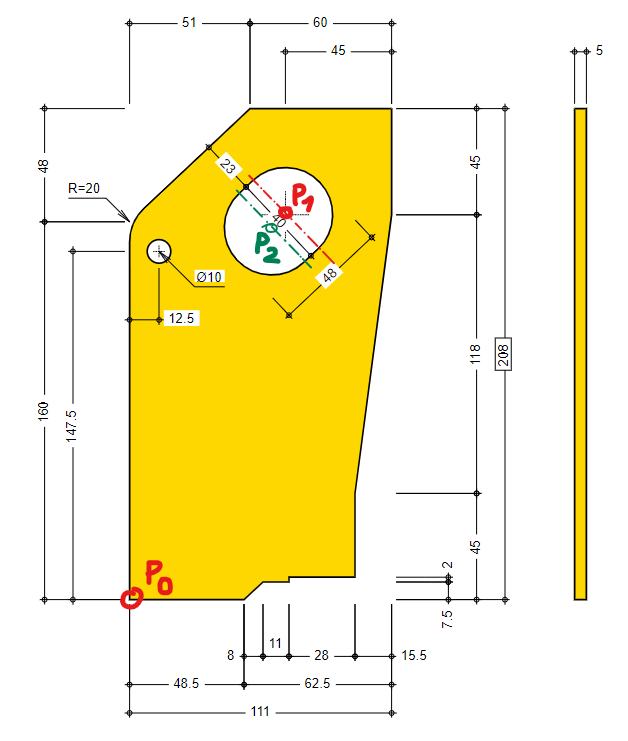

# Bracket problem

This is an annotated drawing of a masonry bracket assembly.


This is an annotated drawing of a masonry bracket plate, which is in turn a part of the masonry bracket assembly.


1. If the point $P_0$ lies on the coordinate $$P_0 = (0, 0),$$ what is the coordinate of the point $P_1$?



2. Do you have enough information in the above image to calculate the coordinate of the point $P_2$? If yes, how would you calculate it?


3. Do you have enough information to calculate the mass of the bracket plate?

4. Given a list of vertexes on the polygon:

```python
vertexes = [
    {"x": 0.0, "y": 0.0},
    {"x": 0.0, "y": 0.1475},
    {"x": 0.0, "y": 0.160, "r": 0.020},
    {"x": 0.051, "y": 0.208},
    {"x": 0.111, "y": 0.208},
    ...
]
```

can you explain an algorithm that calculates the surface area, the volume and the mass of the bracket plate?
