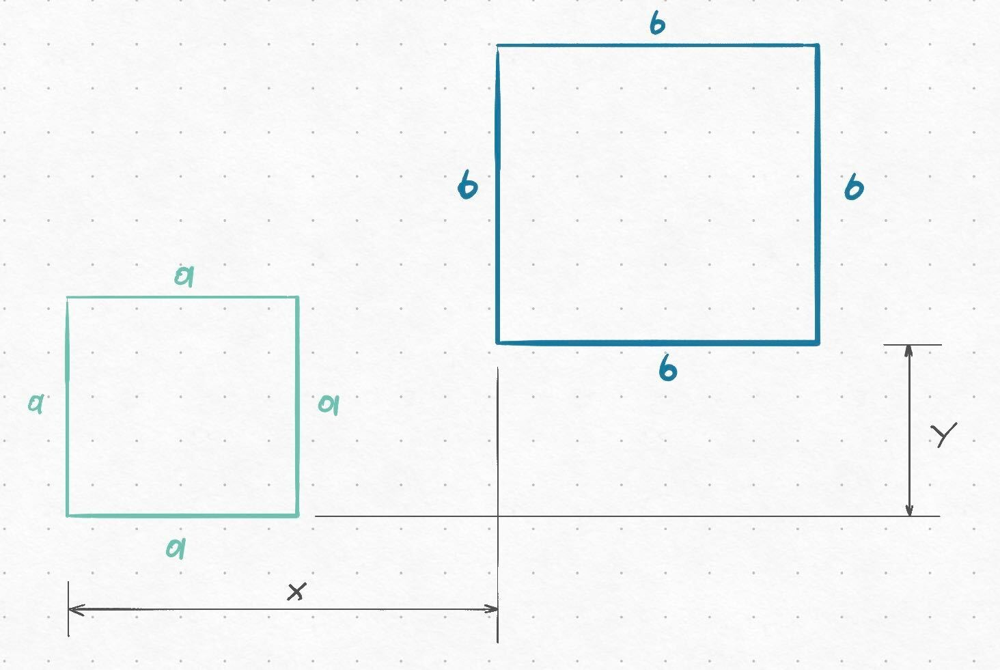
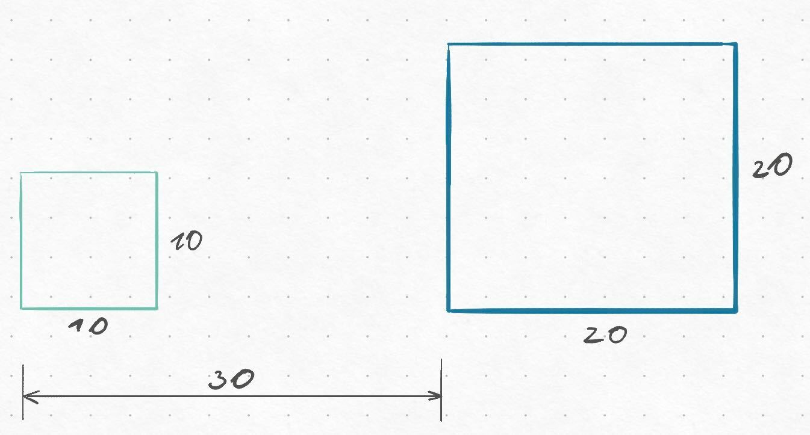
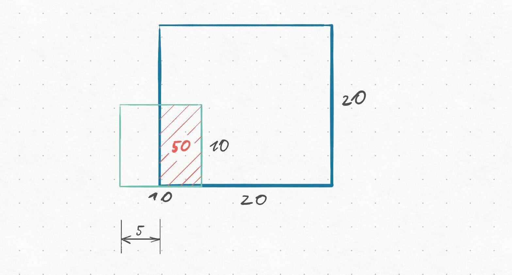
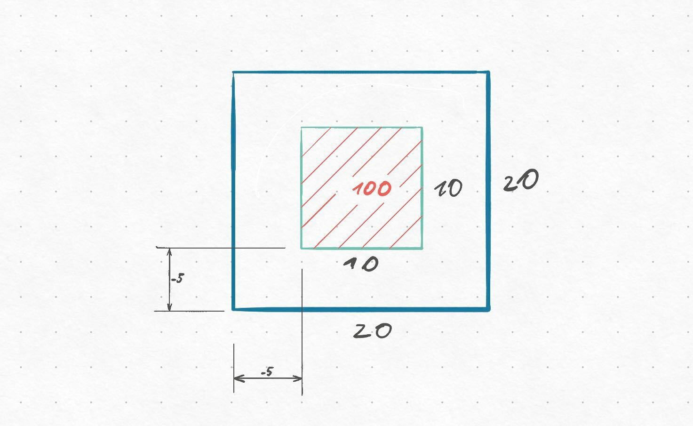

# Square intersection problem

On the image below, you have two squres with sizes $a \times a$ and $b \times b$. The $x$- and $y$- distance between their origins is $x$ and $y$.



Create a function `square_intersection(a, b, x, y)` that calculates the intersection area between these two squares.

Examples:

```
>>> square_intersection(10, 20, 30, 0)
0.0
```


```
>>> square_intersection(10, 20, 5, 0)
50.0
```


```
>>> square_intersection(10, 20, -5, -5)
100.0
```

